# Exemple de Processus Gaussien

## Mise en place du serveur

```
- Centos 7.1 Installation
	- Language: English (United States)
	- Software selection: Gnome Desktop
	- KDUMP: disable
	- Security policy: No profile selected
```

## Configuration OS

```
yum update -y

/etc/selinux/config:
SELINUX=disabled

systemctl stop firewalld.service
systemctl disable firewalld.service

yum install -y https://download.postgresql.org/pub/repos/yum/11/redhat/rhel-7-x86_64/pgdg-centos11-11-2.noarch.rpm
yum install python3.x86_64  git.x86_64  gcc.x86_64 python3-devel.x86_64 
yum install postgresql11-server postgresql11 postgresql11-devel.x86_64
pip3 install pipenv
```

## Mise en place depuis github

```
pipenv install
```

## Mise en place initiale de l'environement virtuel

Si on ne passe par par github et Pipfile:

```
pipenv --python /usr/bin/python3
pipenv install 'tensorflow<2.0'
pipenv install numpy
pipenv install 'gpflow<2.0'
```

## Les exemples

### Exemple 1: Une fonction sigmoide 

Pour simuler l'effet d'un cache sur le temps de réponse

```
pipenv run python run1.py
```

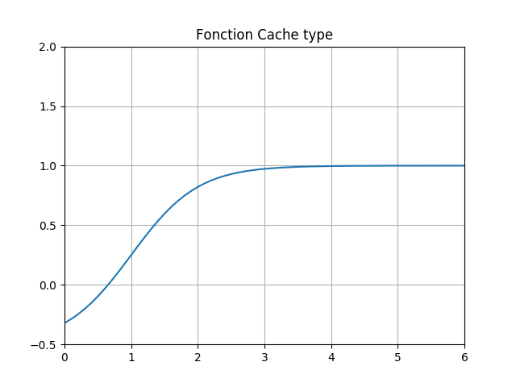

### Exemple 2: Une première régression

Une première regression gaussienne à partir d'un ensemble de point

```
pipenv run python run2.py
```

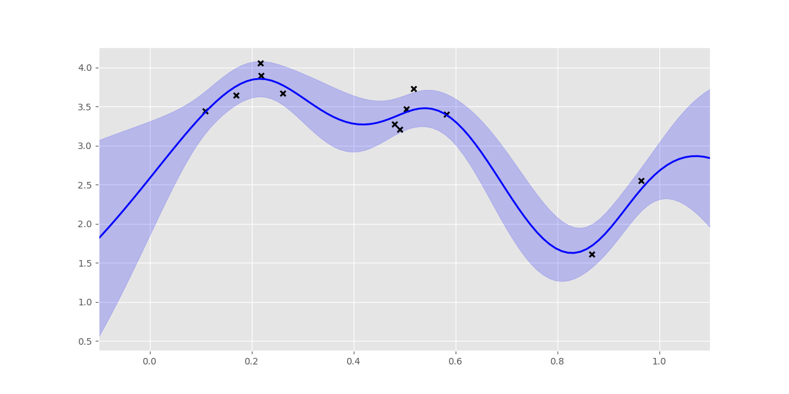

### Exemple 3: Régression sur la fonction sigmoide

```
pipenv run python run3.py
```

On commence sans optimisation des hyperparametres (ligne 24 et 25 commentées):

```
#gpflow.train.ScipyOptimizer().minimize(m)
#print(m)
```

On a:
```
                             class prior transform  trainable shape  fixed_shape value
GPR/kern/lengthscales    Parameter  None       +ve       True    ()         True   0.3
GPR/kern/variance        Parameter  None       +ve       True    ()         True   1.0
GPR/likelihood/variance  Parameter  None       +ve       True    ()         True  0.01
```

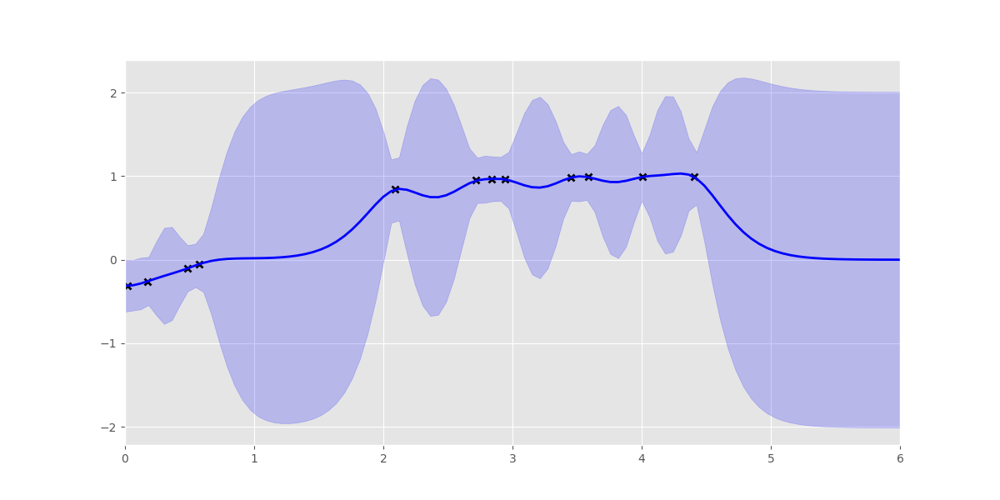

On peut augmenter le nombrede point à 20 (ligne 12):

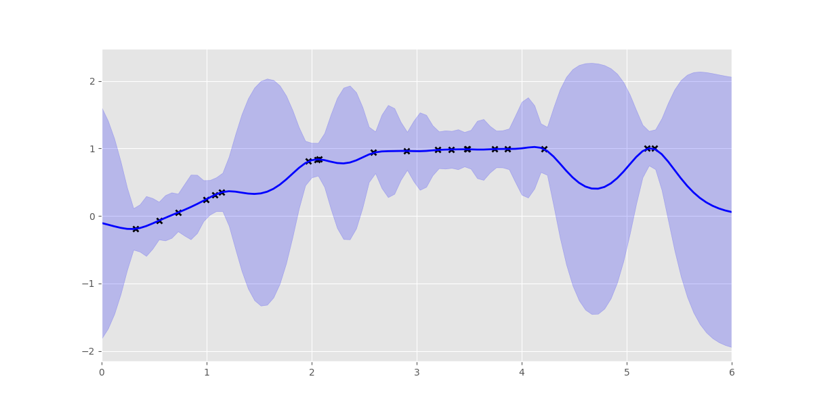

Avec optimisation:
```
                             class prior transform  trainable shape  fixed_shape                  value
GPR/kern/lengthscales    Parameter  None       +ve       True    ()         True      5.474471159944401
GPR/kern/variance        Parameter  None       +ve       True    ()         True     1.6626323263700333
GPR/likelihood/variance  Parameter  None       +ve       True    ()         True  1.000001721511822e-06
```

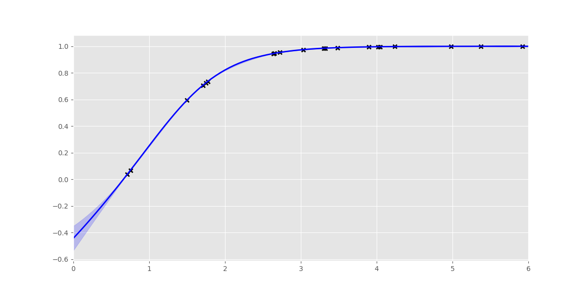

Sur cette dernière images il y a peu de variance entre le 2e et 3e point
Si je veux une confiance plus faible je dois diminuer GPR/kern/lengthscales
Je vais donc le fixé pour diminuer la confiance entre des intervalles trop grandes.

On décommente ligne 20 et 21: 

```
m.kern.lengthscales.trainable = False
m.kern.lengthscales = 1.0
```
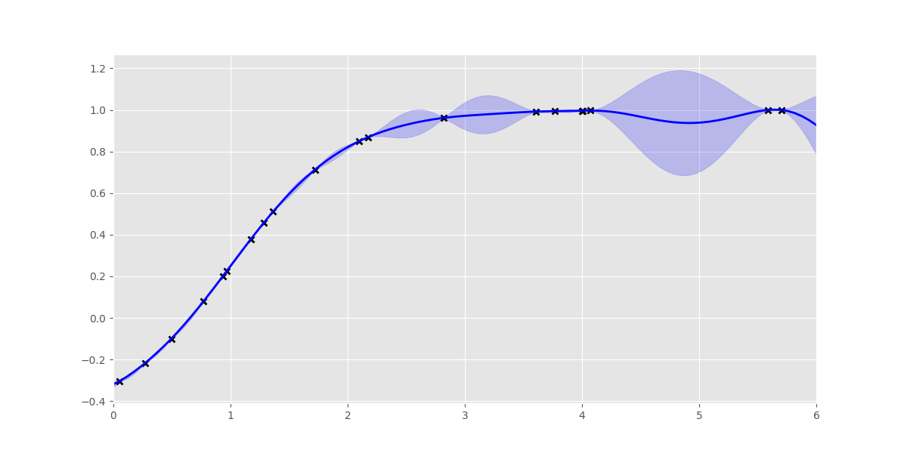
 
### Exemple 4: Une fonction dbtime avec un paramêtre

```
pipenv run python run4a.py
```

Ma fonction dbtime sera de la forme suivante.
On notera quelle possède deux minimums locales en plus du minum global.

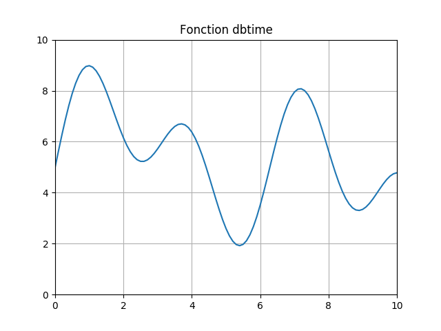

```
pipenv run python run4b.py
```

Tentative de régression avec 10 points. On notera les zones inconnu avec un potentiel minimum globale

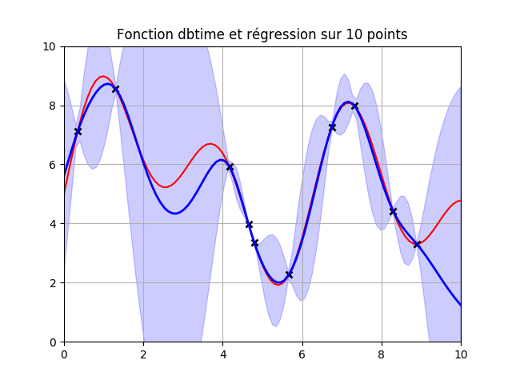

SI on augmente le nombre de point:

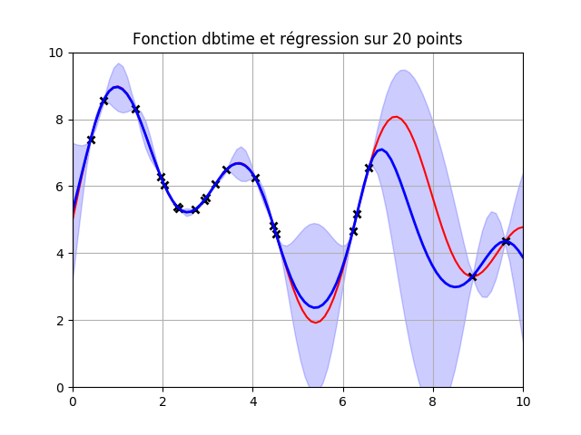

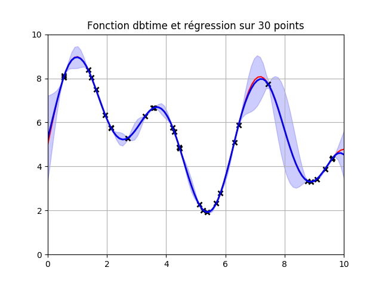

A la fin on note que la courbe obtenue colle assez bien à la focntion d'origine
Mais nous avons 30 mesures !!

### Exemple 5: Trouver les points à explorer

On devrait obtenir la même chose que précédement avec moins de points
Il faut définir une fonction d'acquisition qui détermine le prochain point à exploré

Par exemple: -mean+k.var

```
pipenv run python run5a.py
```

Ici je prend 5 points au hazard et je faire une recherche sur les 5 prochains points:

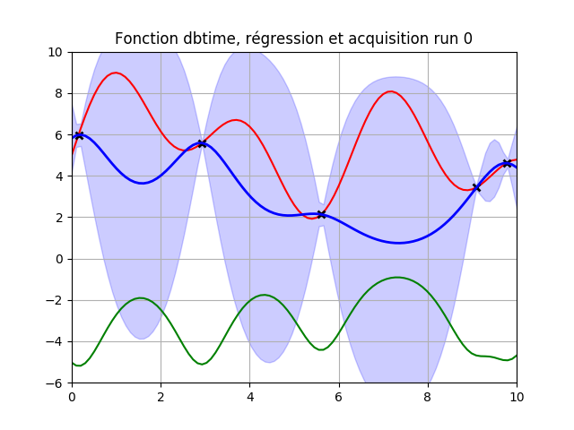
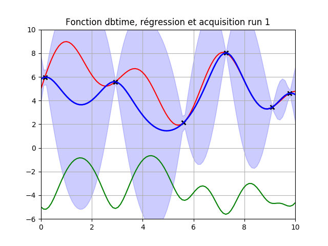
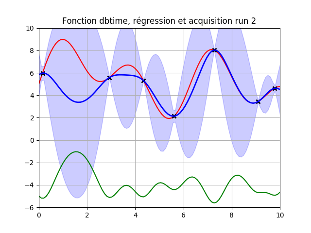
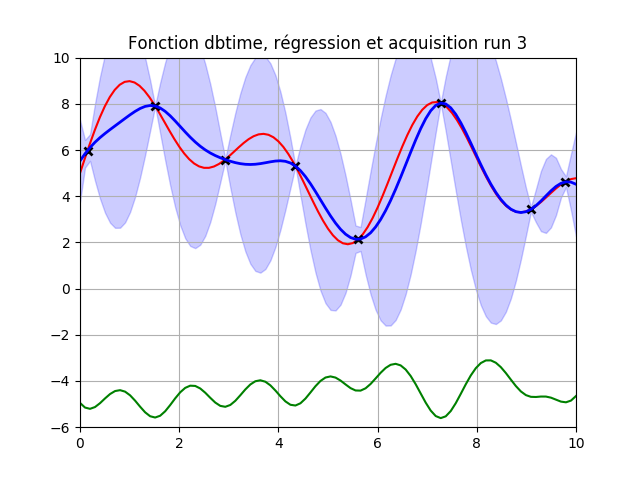
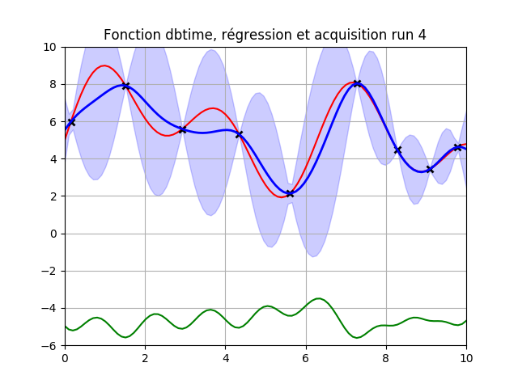

### Exemple 6: Trouver le minimum

Je vais transformer sous forme d'objet le code précédent
On y configurera un certains nombre de run et l'objet nous retournera le minimum global.

Toujours avec la même fonction

```
pipenv run python run6a.py
```

Après 20 run:

```
Searching for min...
10.0
0.0
5.555555555555555
8.787878787878787
4.646464646464646
6.4646464646464645
0.8080808080808081
9.292929292929292
5.151515151515151
5.353535353535354
5.353535353535354
5.353535353535354
5.353535353535354
5.353535353535354
5.353535353535354
5.353535353535354
5.353535353535354
5.353535353535354
5.353535353535354
5.353535353535354
```

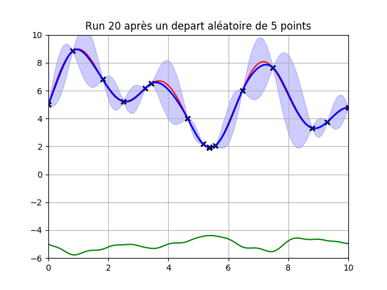

Pour l'exemple suivant on passe sur une focntion à deux paramètres, dernier exemple avant une généralisation à x paramètres et dernier exemple graphable.

Voici ma nouvelle fonction:

```
pipenv run python run6b.py
```

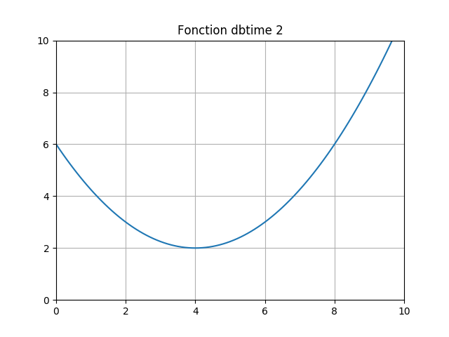


Une recherche par grille nous donne le minimum de la fonction suivante à deux paramètres:

```
pipenv run python run6d.py
```

```
x1: %d [4.04040404]
x2: %d [5.35353535]

dbtime(x) = 5.90
```

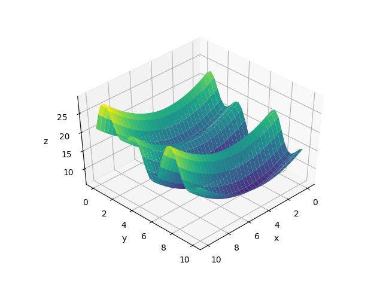

Maintenant la recherche sur cette précédente fonction avec 2 paramètres:

```
pipenv run python run6e.py
```

Ce qui donne:

```
Searching for min...
Next point to explore: [2.4 9.9] and dbtime(x)=[12.12074524]
Next point to explore: [2.3 8.5] and dbtime(x)=[10.28087977]
Next point to explore: [3.8 0. ] and dbtime(x)=[12.01]
Next point to explore: [2.3 7.8] and dbtime(x)=[15.77215567]
Next point to explore: [3.9 9.2] and dbtime(x)=[9.16841516]
Next point to explore: [9.6 4.5] and dbtime(x)=[19.13449986]
Next point to explore: [2.2 2. ] and dbtime(x)=[15.1029217]
Next point to explore: [7.3 5.5] and dbtime(x)=[8.66369986]
Next point to explore: [0.  5.1] and dbtime(x)=[10.61260996]
Next point to explore: [4.6 5.4] and dbtime(x)=[5.92995689]
Next point to explore: [3.4 5.3] and dbtime(x)=[6.01388963]
Next point to explore: [4.2 5.2] and dbtime(x)=[6.19587824]
Next point to explore: [4.  5.4] and dbtime(x)=[5.83995689]
Next point to explore: [4.2 5.3] and dbtime(x)=[5.93388963]
Next point to explore: [3.8 5.4] and dbtime(x)=[5.84995689]
Next point to explore: [3.9 5.4] and dbtime(x)=[5.84245689]
Next point to explore: [4.  5.4] and dbtime(x)=[5.83995689]
Next point to explore: [4.  5.4] and dbtime(x)=[5.83995689]
Next point to explore: [4.  5.4] and dbtime(x)=[5.83995689]
Next point to explore: [4.  5.4] and dbtime(x)=[5.83995689]
```

Dans cette exemple nous fesons 20 recherches après un tirage au sort de 10 points
Le minimum global a été trouvé après 13 tentatives !


## Outils et sources

* [Editeur Sublim](https://www.sublimetext.com/)
* [Installation du plugins Markdown Preview](http://plaintext-productivity.net/2-04-how-to-set-up-sublime-text-for-markdown-editing.html)
* [Documentations GPFlow](https://gpflow.readthedocs.io/en/stable/index.html)
* [GitHub GPflow](https://github.com/GPflow/GPflow)
* [Les releases TensorFlow](https://pypi.org/project/tensorflow/#history)


